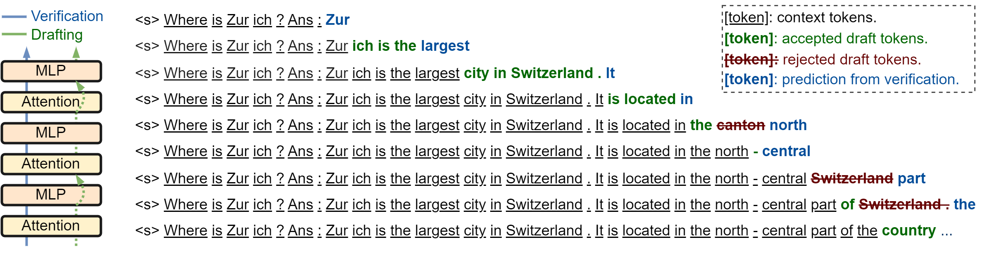

<div align="center">
<h1>
      
    <br>  
    Self-Speculative Decoding
</h1>
</div>
Code associated with the paper:

**[ACL 2024] [Draft &amp; Verify: Lossless Large Language Model Acceleration via Self-Speculative Decoding](https://arxiv.org/abs/2309.08168)**



Self-Speculative Decoding is a novel inference scheme for accelerating Large Language Models (LLMs) without additional neural network training and extra memory footprint. It not only maintains consistent output quality but also ensures model compatibility, making it a *plug-and-play* and *cost-effective* solution for LLM inference acceleration.

Self-Speculative Decoding involves a two-stage process:

**Drafting stage:** Generates draft tokens by selectively skipping certain intermediate layers.

**Verification stage:** Employs the original LLM to validate draft tokens in one forward pass.

## Cite Our Paper

If you find this code and paper useful in your research, please consider citing:

```
@article{zhang2023draft,
      title={Draft & Verify: Lossless Large Language Model Acceleration via Self-Speculative Decoding}, 
      author={Jun Zhang, Jue Wang, Huan Li, Lidan Shou, Ke Chen, Gang Chen, Sharad Mehrotra},
      year={2023},
      eprint={2309.08168},
      archivePrefix={arXiv},
      primaryClass={cs.CL}
}
```

## Requirements

- PyTorch
- Transformer
- NumPy
- More in ssd.yml

## Files

- searching.py: Selection of skipped layers by Bayesian optmization
- decoding.py: Core process of self-speculative decoding
- modeling_llama.py: Model structure with self-speculative decoding
- search.ipynb: Main script searches for skipped layers
- evaluate_sum.ipynb: Main script evaluates self-speculative decoding on text generation task
- evaluate_code.ipynb: Main script evaluates self-speculative decoding on code generation task
- skip_layers.json: Layers skipped by draft models corresponding to different base models
- ssd.yml: Relevant environment

## Usage

1. Configure the relevant environment according to ssd.yml;
2. Execute search.ipynb to get skipped layers to generate a draft model;
3. Execute evaluate_sum.ipynb to evaluate self-speculative decoding on summarization;
4. Execute evaluate_code.ipynb to evaluate self-speculative decoding on code generation.
