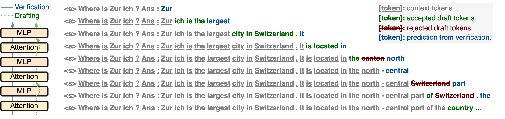

# self-speculative-decoding



Code associated with the paper **Draft &amp; Verify: Lossless Large Language Model Acceleration via Self-Speculative Decoding**

Self-Speculative Decoding is a novel inference scheme for accelerating Large
Language Models (LLMs). It maintains output quality while ensuring model compatibility. This method requires no extra training or memory, making it a *plug-and-play* and *cost-effective* solution for LLM inference acceleration.

This approach is characterized by a two-stage process: 

**Drafting stage:** Generating draft tokens at a slightly lower quality but more
quickly, which is achieved by selectively skipping certain intermediate layers during drafting.
**Verification stage:** Employing
the original LLM to validate those draft output tokens in one forward pass.

## Cite Our Paper

If you find this code useful in your research, please consider citing:

```
@article{zhang2023draft,
      title={Draft & Verify: Lossless Large Language Model Acceleration via Self-Speculative Decoding}, 
      author={Jun Zhang and Jue Wang and Huan Li and Lidan Shou and Ke Chen and Gang Chen and Sharad Mehrotra},
      year={2023},
      eprint={2309.08168},
      archivePrefix={arXiv},
      primaryClass={cs.CL}
}
```
